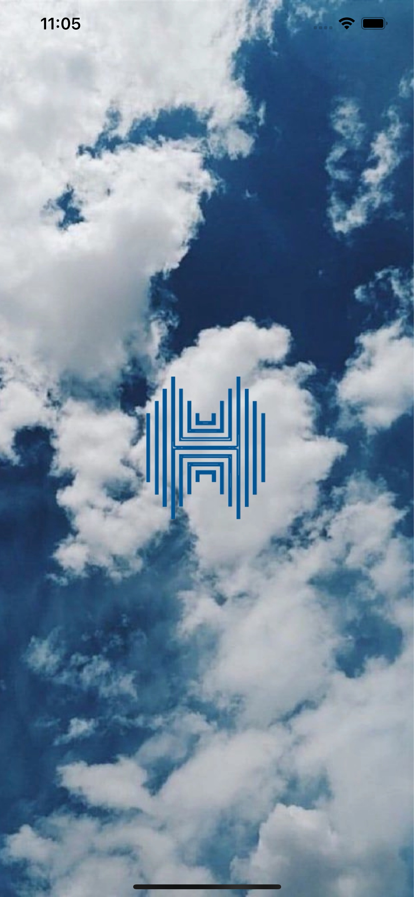
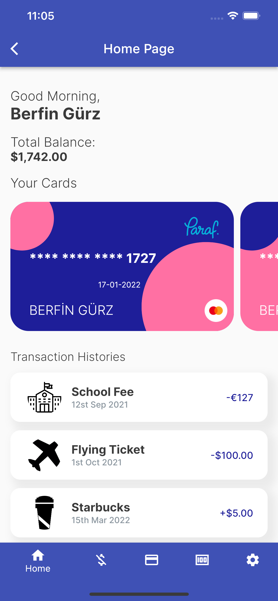

# Banking App

This Flutter project was developed for the software internship of Istanbul Kultur University Computer Engineering student.

## Aim of Project
The aim of this project is to implement an application similar to the applications used by the Mobile Banking sector.

## Getting Started
This project is a starting point for a Flutter application.

A few resources to get you started if this is your first Flutter project:

- Lab: Write your first Flutter app
- Cookbook: Useful Flutter samples
For help getting started with Flutter, view our online documentation, which offers tutorials, samples, guidance on mobile development, and a full API reference.

And also, 
- run ```flutter pub get``` command to install packages.
## Ekran Görüntüleri

- Splash Screen


- Home Screen


Other screenshots are in the "screenshots" file.


  
